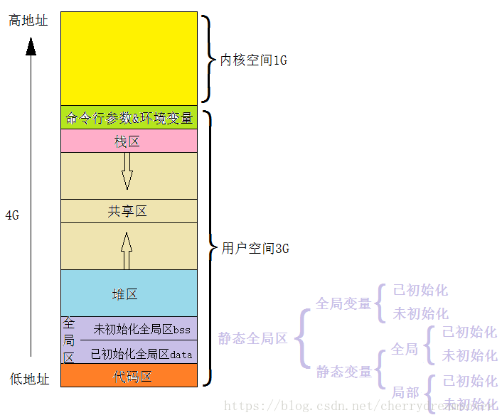

# 内存管理

## C++程序内存分配

- 程序占用内存分为以下几个部分
  - 栈区（stack）：由编译器自动分配与释放，存放为运行时函数分配的局部变量、函数参数、返回数据、返回地址等。其操作类似于数据结构中的栈。
  - 堆区（heap）：一般由程序员自动分配，如果程序员没有释放，程序结束时可能有OS回收。其分配类似于链表。
  - 全局区（静态区static）：存放全局变量、静态数据、常量。程序结束后由系统释放。全局区分为已初始化全局区（data）和未初始化全局区（bss）。
  - 常量区（文字常量区）：存放常量字符串，程序结束后有系统释放。
  - 代码区：存放函数体（类成员函数和全局区）的二进制代码。

- 内存分配方式

  - 从静态存储区分配

    > 内存在程序编译的时候已经分配好，这块内存在程序的整个运行期间都存在。例如全局变量，static变量。

  - 在栈上创建

    > 在执行函数时，函数内局部变量的存储单元可以在栈上创建，函数执行结束时，这些内存单元会自动被释放。
    > 栈内存分配运算内置于处理器的指令集，效率高，但是分配的内存容量有限。

  - 从堆上分配

    > 亦称为动态内存分配。
    > 程序在运行的时候使用malloc或者new申请任意多少的内存，程序员自己负责在何时用free或delete释放内存。
    > 动态内存的生命周期有程序员决定，使用非常灵活，但如果在堆上分配了空间，既有责任回收它，否则运行的程序会出现内存泄漏，频繁的分配和释放不同大小的堆空间将会产生内存碎片。

​                                 

- 全局对象在程序启动时分配，在程序结束时销毁。局部对象在进入其定义所在的程序块时被创建，离开块时被销毁。

- 动态分配的对象的生存期与它们在哪里创建是无关的，只有当显式地被释放时，这些对象才被销毁

## new和malloc区别

