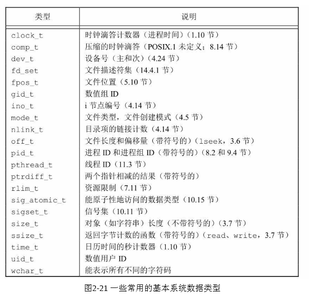

# 正则表达式

- 正则表达式(regular expression)，可简写为regex或RE，是用来简洁表达一组字符串的表达式

- [正则表达式语法规则](<https://www.jianshu.com/p/e25c4cfc8f4e>)

- 正则表达式的编译：将符合正则表达式语法的字符串转换成正则表达式特征

  ​	

# 基本系统数据类型

​	历史上，某些UNIX变量已与某些C数据类型联系在一起，例如，历史上主、次设备号存放在一个1 6位的短整型中， 8位表示主设备号，另外8位表示次设备号。但是，很多较大的系统需要用多于256个值来表示其设备号，于是，就需要有一种不同的技术。

​	头文件<sys/types.h >中定义了某些与实现有关的数据类型，它们被称之为基本系统数据类型（primitive system data type）。有很多这种数据类型定义在其他头文件中。在头文件中这些数据类型都是用C的typedef设施来定义的。它们绝大多数都以_t 结尾。用这种方式定义了这些数据类型后，在编译时就不再需要考虑随系统不同而变的实施细节

​	用这种方式定义了这些数据类型后, 在编译时就不再需要考虑随系统不同而变的实施细节。